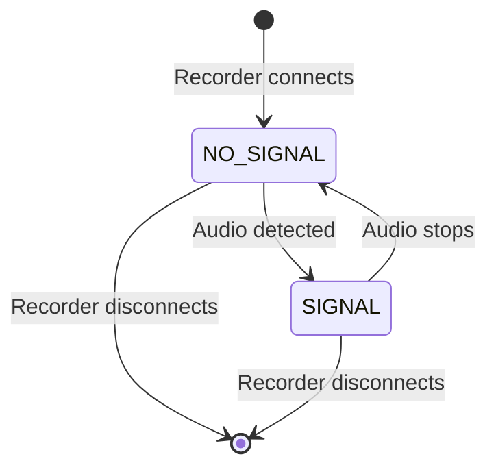
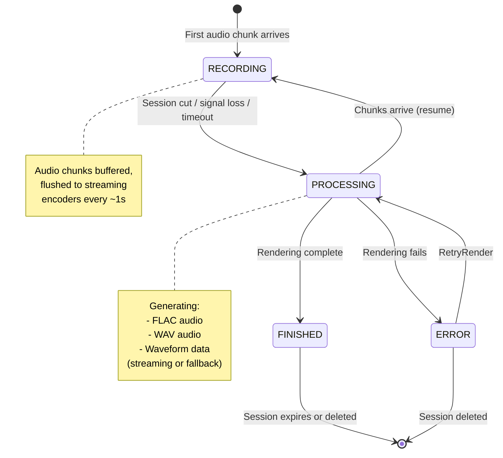
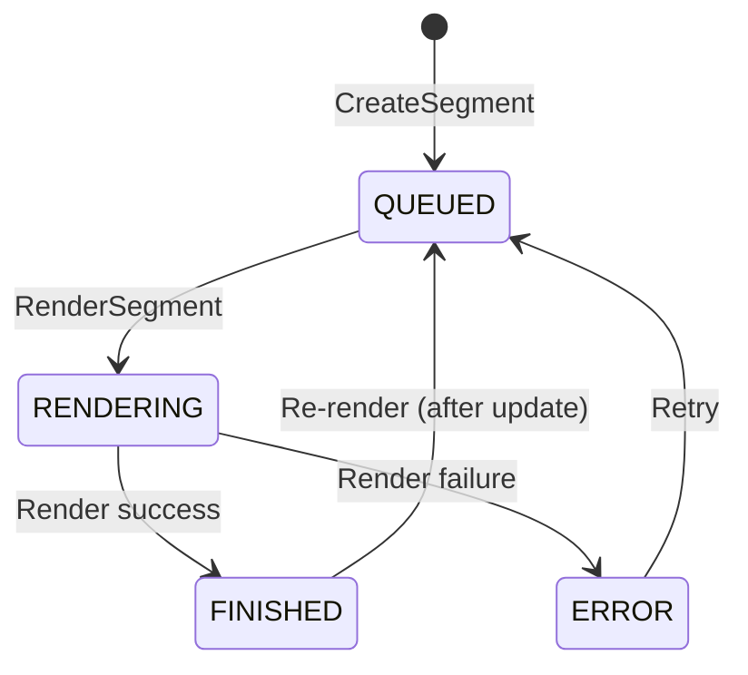
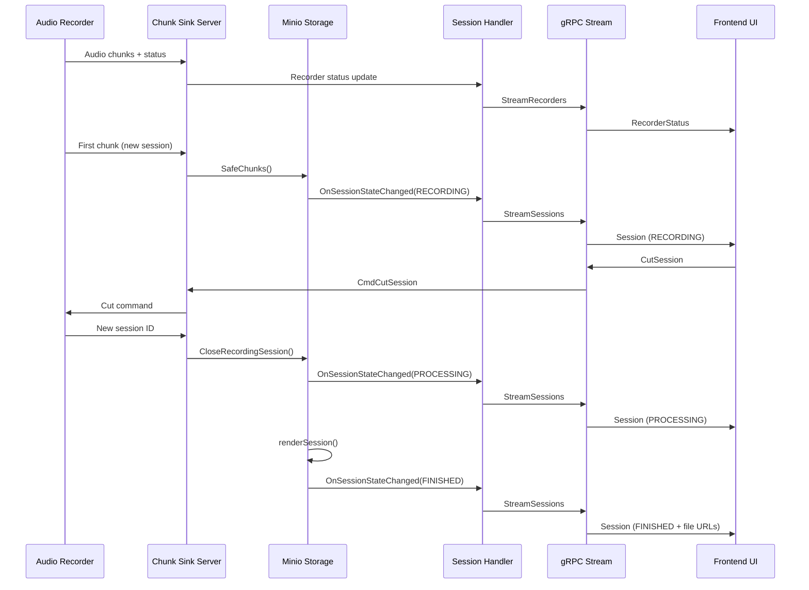
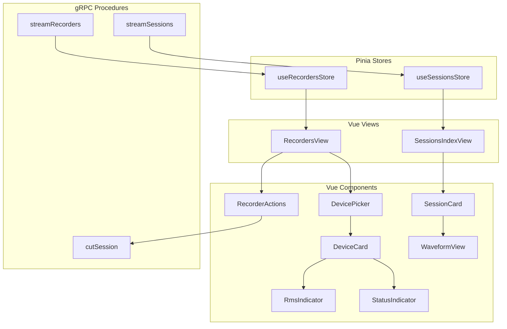
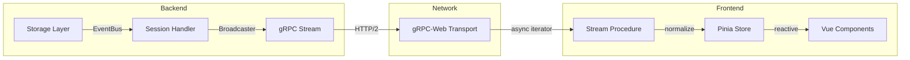

# Session Recorder State Lifecycle

This document describes the state machines, data flow, and concurrency model for recorders and sessions.

## Table of Contents

- [Recorder Lifecycle](#recorder-lifecycle)
- [Session Lifecycle](#session-lifecycle)
- [Segment Lifecycle](#segment-lifecycle)
- [Data Flow Architecture](#data-flow-architecture)
- [Backend Internals](#backend-internals)
- [Component Hierarchy](#component-hierarchy)

---

## Recorder Lifecycle

Recorders represent audio input devices. They stream their status continuously via gRPC.

### Recorder States



### Signal Status Values

| State | Description |
|-------|-------------|
| `NO_SIGNAL` | Recorder connected but no audio input detected |
| `SIGNAL` | Audio input detected, recording in progress |

### Connection Flow

```
C++ client connects via gRPC GetCommands()
  → Server stores send function in map (mutex-protected)
  → OnRecorderConnectedCB fires synchronously (after mutex release)
  → Stream blocks on context.Done()
  → On disconnect: map entry deleted, OnRecorderDisconnectedCB fires
  → If recording was active: session closed with 30s timeout
```

### Recorder Status Data

| Field | Type | Description |
|-------|------|-------------|
| `recorderID` | string | Unique identifier |
| `recorderName` | string | Display name |
| `signalStatus` | SignalStatus | NO_SIGNAL or SIGNAL |
| `rmsPercent` | double | Audio level (0-100%) |
| `clipping` | bool | True if audio is clipping |

---

## Session Lifecycle

Sessions are created when a recorder starts capturing audio.

### Session State Machine



### Session States

| State | Description |
|-------|-------------|
| `RECORDING` | Actively receiving audio chunks from recorder |
| `PROCESSING` | Session closed, rendering audio files |
| `FINISHED` | All files rendered, available for playback/download (terminal) |
| `ERROR` | Rendering failed, error message available |

### State Transitions

| From | To | Trigger | Notes |
|------|----|---------|-------|
| — | RECORDING | First chunk arrives | `SafeChunks()` creates session + streaming encoders |
| RECORDING | PROCESSING | Cut / signal loss / timeout / session switch | FSM trigger `CloseRecording` |
| PROCESSING | FINISHED | Render completes | FSM trigger `RenderSuccess` |
| PROCESSING | ERROR | Render fails | FSM trigger `RenderFailure`, error stored in metadata |
| PROCESSING | RECORDING | Chunks arrive | Resume — FSM replaced, session returns to RECORDING |
| ERROR | PROCESSING | Manual retry | FSM trigger `RetryRender`, clears error message |

### Recording Flow

1. **Chunk reception**: `SetChunks()` → `ChunkSinkHandler.setChunks()` → `Minio.SafeChunks()`
2. **Buffering**: Chunks accumulated in `bytes.Buffer`, flushed to streaming encoders every ~1s
3. **Streaming encode**: 4 parallel pipelines (raw PCM, FLAC, WAV, waveform) via `io.Pipe` + `PutObject`
4. **Session close**: Remaining buffer flushed, encoders closed, FSM transitions to PROCESSING
5. **Render completion**: Streaming close returns → FSM transitions to FINISHED

### Session Close Triggers

- **Explicit**: User cuts session via `CutSession` RPC
- **Signal loss**: `setRecorderStatus` detects `wasRecording && !nowRecording`
- **Session switch**: New session ID arrives in `setChunks`, previous session closed
- **Timeout**: Session timeout checker closes sessions with no chunks for 30s (configurable)
- **Disconnect**: `OnRecorderDisconnected` closes active session with 30s timeout

---

## Segment Lifecycle

Segments are user-defined clips within a finished session.

### Segment State Machine



### Segment States

| State | Description |
|-------|-------------|
| `QUEUED` | Segment created, waiting for render |
| `RENDERING` | Render in progress |
| `FINISHED` | Rendered files available |
| `ERROR` | Render failed |

Transitions are validated by `validateSegmentTransition()` — no FSM object, just a transition table.

On server restart, segments stuck in `RENDERING` are recovered to `ERROR` with message "interrupted by server restart".

---

## Data Flow Architecture

### Backend to Frontend Streaming



### gRPC Service Methods

| Method | Type | Description |
|--------|------|-------------|
| `StreamRecorders` | Server streaming | Continuous recorder status updates |
| `StreamSessions` | Server streaming | Session state changes per recorder |
| `StreamSessionAudio` | Server streaming | Live audio chunks during recording |
| `StreamWaveformPeaks` | Server streaming | Live waveform peaks during recording |
| `CutSession` | Unary | Request to stop current recording |
| `SetKeepSession` | Unary | Prevent session from auto-expiring |
| `DeleteSession` | Unary | Remove session immediately |
| `SetName` | Unary | Rename a session |
| `RetryRenderSession` | Unary | Retry failed render |
| `CreateSegment` | Unary | Create a clip within a session |
| `RenderSegment` | Unary | Render a segment to audio file |

---

## Backend Internals

### Shutdown Sequence

```
Stop()
  → close(stopTimeout)          // Stops session timeout checker
  → renderQueue.stopAndWait()   // Waits for all in-flight render jobs
  → shutdownCancel()            // Cancels streaming upload goroutines
```

The work queue uses `stopAndWait()` to ensure in-flight renders complete before shutdown. The work queue context is only cancelled *after* the pool drains, so in-flight S3 uploads finish before context invalidation.

### Concurrency & Locking

| Lock | Protects | Rules |
|------|----------|-------|
| `dataLock` | `system`, `chunks`, `lastChunkTime`, `deletedSessions` | Never emit events while held |
| `machineLock` | `sessionMachines` map | Released before `sm.FireCtx()` |
| `EventBus.mu` | Listener list | RWMutex; listeners must be fast and non-blocking |

**Key invariant**: Event emission (`EmitSessionStateChanged`, `EmitSegmentStateChanged`) always happens **outside** `dataLock` to prevent deadlocks with listeners that call `GetSession`/`GetSessions`.

The `onSessionTransition` callback validates that the in-memory session state matches the FSM's expected source state. This guards against stale SM references (e.g., after resume replaces the FSM).

### Tombstone Cleanup

Deleted sessions are tracked in `deletedSessions` with timestamps to prevent resurrection by stale render callbacks. Entries are cleaned up:
- Amortized during `DeleteSession()` calls
- Periodically by `sweepDeletedSessions()` in the session timeout checker

Entries older than 1 minute are removed.

### Broadcasting

`Broadcaster[T]` fans out messages to subscribers via buffered channels (size 10 in production). Non-blocking send — messages dropped if a subscriber's buffer is full.

- `Close()` closes all subscriber channels, unblocking waiting goroutines
- Unsubscribe is idempotent and safe to call concurrently with Broadcast

### Peak Accumulator

Live waveform peaks are accumulated during recording and removed when the session leaves `RECORDING` state — including transitions to `PROCESSING`, `ERROR`, and `FINISHED`.

---

## Component Hierarchy

### Frontend Architecture



### State Update Flow



---

## File Reference

### Backend

| File | Purpose |
|------|---------|
| `go/storage/storage.go` | Session/Segment types, Storage interface |
| `go/storage/statemachine.go` | Session FSM, segment transition validation |
| `go/storage/minio.go` | State transitions, S3 persistence, streaming encode, shutdown |
| `go/storage/workqueue.go` | Async render job scheduling |
| `go/storage/eventbus.go` | Event emission to listeners |
| `go/broadcast/broadcast.go` | Fan-out to gRPC stream subscribers |
| `go/cmd/chunk_sink/chunk-sink-handler.go` | Chunk reception, session close on disconnect/signal loss |
| `go/cmd/chunk_sink/session-source-handler.go` | gRPC stream handlers, peak accumulator, event relay |
| `go/grpc/chunksink-server.go` | Recorder connection/disconnection, command routing |
| `go/grpc/sessionsource-server.go` | Session streaming endpoints |

### Frontend

| File | Purpose |
|------|---------|
| `web/src/store/useRecordersStore.ts` | Recorder state management |
| `web/src/store/useSessionsStore.ts` | Session state management |
| `web/src/grpc/procedures/streamRecorders.ts` | Recorder streaming |
| `web/src/grpc/procedures/streamSessions.ts` | Session streaming |
| `web/src/types.ts` | TypeScript type definitions |

### Protocols

| File | Purpose |
|------|---------|
| `protocols/proto/common.proto` | SignalStatus, RecorderStatus |
| `protocols/proto/chunksink.proto` | ChunkSink service |
| `protocols/proto/sessionsource.proto` | SessionSource service, SessionState |

---

## Session Data Structure

### Backend (Go)

```go
type Session struct {
    ID         uuid.UUID
    RecorderID uuid.UUID
    Name       string
    StartTime  time.Time
    EndTime    time.Time
    Duration   time.Duration
    State      SessionState    // RECORDING, PROCESSING, FINISHED, ERROR
    Keep       bool
    ErrorMessage string
    Segments   map[uuid.UUID]Segment
}
```

### Frontend (TypeScript)

```typescript
type Session = {
    id: string;
    startedAt: Date;
    finishedAt: Date | null;
    expiresAt: Date | null;
    name: string;
    keep: boolean;
    state: SessionState;
    errorMessage?: string;
    segments: Segment[];
    inlineFiles: SessionInfo_Files | null;
    downloadFiles: SessionInfo_Files | null;
};
```

---

## UI State Representation

| Session State | UI Display |
|---------------|------------|
| RECORDING | Animated recording indicator, no waveform yet |
| PROCESSING | Spinner, "Processing..." message |
| FINISHED | Full waveform, playback controls, download links |
| ERROR | Error icon, error message display |
