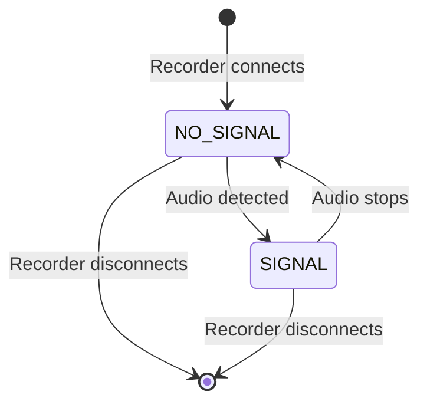
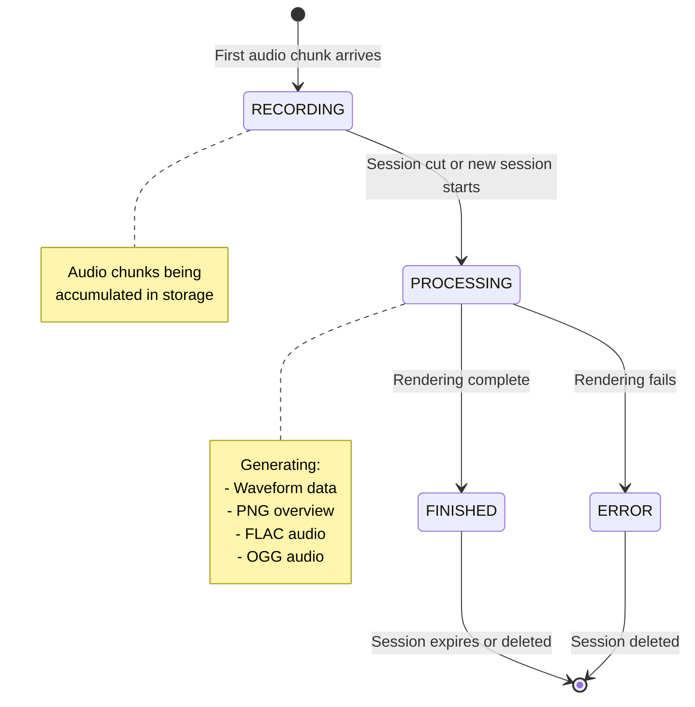
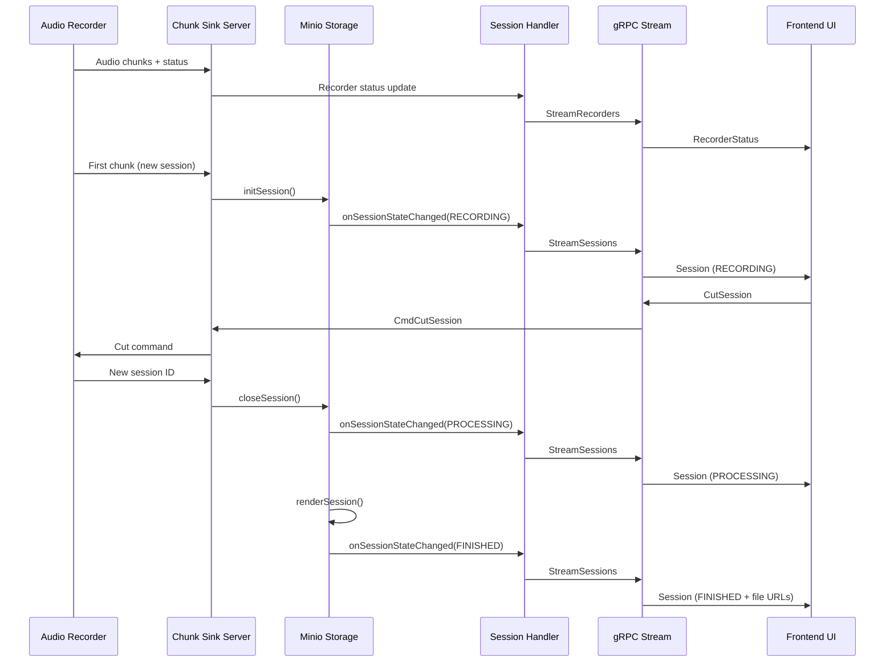
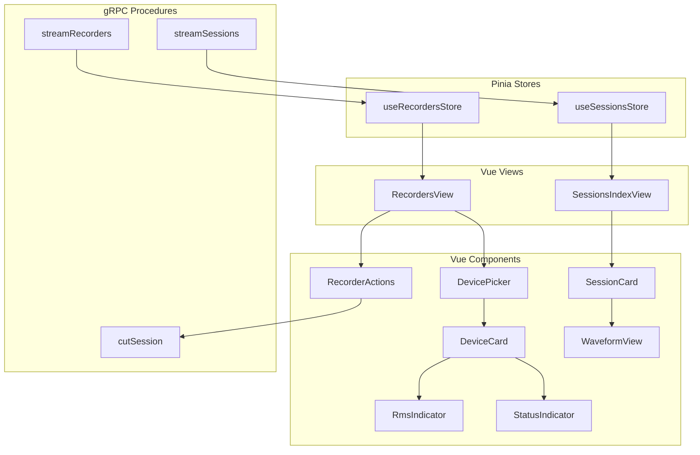
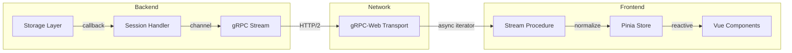

# Session Recorder State Lifecycle

This document describes the state machines and data flow for recorders and sessions in the session-recorder application.

## Table of Contents

- [Recorder Lifecycle](#recorder-lifecycle)
- [Session Lifecycle](#session-lifecycle)
- [Data Flow Architecture](#data-flow-architecture)
- [Component Hierarchy](#component-hierarchy)

---

## Recorder Lifecycle

Recorders represent audio input devices. They stream their status continuously via gRPC.

### Recorder States



### Signal Status Values

| State | Description |
|-------|-------------|
| `NO_SIGNAL` | Recorder connected but no audio input detected |
| `SIGNAL` | Audio input detected, recording in progress |

### Recorder Status Data

The `RecorderStatus` message includes:

| Field | Type | Description |
|-------|------|-------------|
| `recorderID` | string | Unique identifier |
| `recorderName` | string | Display name |
| `signalStatus` | SignalStatus | NO_SIGNAL or SIGNAL |
| `rmsPercent` | double | Audio level (0-100%) |
| `clipping` | bool | True if audio is clipping |

---

## Session Lifecycle

Sessions are created when a recorder starts capturing audio. Each session goes through multiple states before completion.

### Session State Machine



### Session State Values

| State | Description |
|-------|-------------|
| `RECORDING` | Actively receiving audio chunks from recorder |
| `PROCESSING` | Session closed, rendering audio files |
| `FINISHED` | All files rendered, available for playback/download |
| `ERROR` | Rendering failed, error message available |

### State Transitions

| From | To | Trigger |
|------|-----|---------|
| - | RECORDING | First chunk arrives for new session ID |
| RECORDING | PROCESSING | User cuts session OR new session ID arrives |
| PROCESSING | FINISHED | All render tasks complete successfully |
| PROCESSING | ERROR | Any render task fails |

---

## Data Flow Architecture

### Backend to Frontend Streaming



### gRPC Service Methods

| Method | Type | Description |
|--------|------|-------------|
| `StreamRecorders` | Server streaming | Continuous recorder status updates |
| `StreamSessions` | Server streaming | Session state changes per recorder |
| `CutSession` | Unary | Request to stop current recording |
| `SetKeepSession` | Unary | Prevent session from auto-expiring |
| `DeleteSession` | Unary | Remove session immediately |
| `SetName` | Unary | Rename a session |

---

## Component Hierarchy

### Frontend Architecture



### State Update Flow



---

## File Reference

### Backend Files

| File | Purpose |
|------|---------|
| `go/storage/storage.go` | Session struct, state types, interfaces |
| `go/storage/minio.go` | State transitions, callbacks, rendering |
| `go/cmd/chunk_sink/session-source-handler.go` | gRPC handlers, state streaming |
| `go/grpc/chunksink-server.go` | Command channel for cut session |

### Frontend Files

| File | Purpose |
|------|---------|
| `web/src/store/useRecordersStore.ts` | Recorder state management |
| `web/src/store/useSessionsStore.ts` | Session state management |
| `web/src/grpc/procedures/streamRecorders.ts` | Recorder streaming |
| `web/src/grpc/procedures/streamSessions.ts` | Session streaming |
| `web/src/types.ts` | TypeScript type definitions |

### Protocol Files

| File | Purpose |
|------|---------|
| `protocols/proto/common.proto` | SignalStatus, RecorderStatus |
| `protocols/proto/sessionsource.proto` | SessionState, SessionInfo, gRPC service |

---

## Session Data Structure

### Backend (Go)

```go
type Session struct {
    ID         uuid.UUID
    RecorderID uuid.UUID
    Name       string
    StartTime  time.Time
    EndTime    time.Time
    Duration   time.Duration
    State      SessionState    // RECORDING, PROCESSING, FINISHED, ERROR
    Keep       bool
    ErrorMessage string
    Segments   map[uuid.UUID]Segment
}
```

### Frontend (TypeScript)

```typescript
type Session = {
    id: string;
    startedAt: Date;
    finishedAt: Date | null;
    expiresAt: Date | null;
    name: string;
    keep: boolean;
    state: SessionState;
    errorMessage?: string;
    segments: Segment[];
    inlineFiles: SessionInfo_Files | null;
    downloadFiles: SessionInfo_Files | null;
};
```

---

## UI State Representation

| Session State | UI Display |
|---------------|------------|
| RECORDING | Animated recording indicator, no waveform yet |
| PROCESSING | Spinner, "Processing..." message |
| FINISHED | Full waveform, playback controls, download links |
| ERROR | Error icon, error message display |
